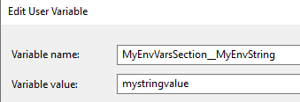

# Wrapping Calls to C# Configuration with the Options Pattern

*Note that this inspired by Microsoft's concept of a pattern, coming from the [framework developed for ASP .NET Core](https://docs.microsoft.com/en-us/aspnet/core/fundamentals/configuration/options?view=aspnetcore-2.1). There's no connection to the functional programming option type.*

This guide covers the rationale for the options pattern. It also provides examples for:

- A custom implementation for .NET full framework applications
- Implementing it with the ASP .NET Core options framework

## Contacts

- Ben Hall
- Rob David

## Benefits

**Fewer string literals**: No repeating of string literals (keys) throughout code, which aids refactoring tools and reduces typing errors.

**Type-safety**: A single location to parse string values to strongly-typed properties (the single benefit of using schema languages to enforce type-safety would not give good ROI).

**Default values**: A single location to return default values when required.

**Validation of values**: A single location to catch missing config entries, misspelled keys or invalid values/types. Sometimes config errors are only reproducible in the environment in which they occur.

**Fail-fast**: Straightforward to read and verify all values at application startup.

**Decoupled**: Code is decoupled from config file markup type.

**Grouped configs**: Group config classes into related settings in order to adhere to **Interface Segregation Principle** and **Separation of Concerns** - that application classes only depend on settings that they use and these settings are decoupled between parts of the applications.

**Nested configs**: Organise config classes via nesting.

**Unit testing**: No need to mirror app.config in the tests project or employ other magic. You can now mock calls to config easily.

[Jump to ASP .NET Core 2.1 Example](#asp-.net-core-2.1-example)

## .NET Full Framework Implementation Example

There are many different ways to implement the Options pattern to work with your team's conventions. This example is overly simplified to point you in the right direction.

It is probably better to work with a static singleton. Injecting it is unlikely to have it read at startup for validation and will add additional work to unit testing.

Grouping of configuration items should fall out organically as development proceeds, into separate classes. Where suited to the domain, nesting may be appropriate.

### .NET Full Framework Example Snippets

Full example in OptionsPatternExamples solution, which includes the nested configurations.

Code examples tested with .NET 4.7.2 and C# 7.3.

#### Example XML Config

```csharp
public class XmlConfig : IConfig
{
    // Examples of nested configuration items
    public ILoggingConfiguration LoggingConfiguration => new LoggingConfiguration();
    public IConnectionStringConfiguration ConnectionStringConfiguration => new ConnectionStringConfiguration();

    // Example of passing through a value from config
    public string MyString => ConfigurationManager.AppSettings["MyString"];

    // Example of returning a default if not value is specified
    public int MyNumber => int.TryParse(ConfigurationManager.AppSettings["MyNumber"], out var value) ? value : 9;

    // Example of returning a non-primitive type
    public Uri MyUri => new Uri(ConfigurationManager.AppSettings["MyUri"]);

    // Example of throwing an error if item is missing in the config file or it is not possible to parse the type
    public bool MyBoolThatMustBeDefined =>
        bool.TryParse(ConfigurationManager.AppSettings["MyBoolThatMustBeDefined"], out var val)
            ? val
            : throw new ConfigurationErrorsException("Could not parse your favourite boolean.");

    // Example of additional validation
    public string MyIpAddress
    {
        get
        {
            var ip = ConfigurationManager.AppSettings["MyIpAddress"];

            if (!string.IsNullOrEmpty(ip))
            {
                string pattern =
                    @"^([1-9]|[1-9][0-9]|1[0-9][0-9]|2[0-4][0-9]|25[0-5])(\.([0-9]|[1-9][0-9]|1[0-9][0-9]|2[0-4][0-9]|25[0-5])){3}$";

                var regex = new Regex(pattern);
                var match = regex.Match(ip);

                if (match.Success)
                {
                    return ip;
                }
            }

            throw new ConfigurationErrorsException("Valid IP address not supplied for MyIpAddress.");
        }
    }
}
```

#### Example Use of Config Class

```csharp
internal class Program
{
    private static void Main(string[] args)
    {
        // ...

        var myString = config.MyString;
        var loggingFilePath = config.LoggingConfiguration.FilePath;
        var loggingMaxLevel = config.LoggingConfiguration.MaximumLevel;

        // ...
    }
}
```

#### Example Validating Class From Startup Code

```csharp
public static void ValidateConfig(this IConfig config)
{
    JsonConvert.SerializeObject(config);
}
```

## ASP .NET Core 2.1 Example

### Using the example solution

Core21OptionsPatternExample is located in the same folder as this document.

- A good place to set a breakpoint to see the values is line 20 of HomeController.cs.
- A breakpoint on line 21 of Startup.cs will allow you to inspect providers and everything that was 'found' in them
- You will need to set the environment variable ```MyEnvVarsSection__MyEnvString```
- You will need a Azure Key Vault with your account setup as a service principal then add the URL to line 59 of Program.cs

From within Visual Studio 2019 you can now select an account to authenticate in Azure with, under *Tools -> Options -> Asure Service Authentication -> Account Selection*.

### Introduction

The aim is to get the same benefits as above with strongly typed config binding to POCO objects. The focus is on .NET Core 2.1 as this is our current default for the Long Term Support (LTS).

There are a few ways to do achieve this, including registering POCOs directly as services or following guides on 'ways to work around' the dependency, which never sounds good. After weighing up the additional dependency against the benefits, we have chosen the ASP .NET 'options pattern' framework. 

IOptions wraps up the .NET Core ```IConfiguration``` to give you a little extra out of the box. The edge case where the balance might shift is where you write a library that depends on IOptions where the consumer is not using it and doing so would force them to take the dependency.

We've had to roll our own validation as this only arrived in Core 2.2.

### Benefit - First-class support for multiple providers

Seamlessly construct a POCO for a particular config duty from a range of [providers](https://docs.microsoft.com/en-us/aspnet/core/fundamentals/configuration/?view=aspnetcore-2.1#providers), including:

- JSON, XML and INI files
- Environment variables
- Command line args
- Azure Key Vault
- User Secrets

There's also a [custom provider](https://docs.microsoft.com/en-us/aspnet/core/fundamentals/configuration/?view=aspnetcore-2.2#custom-configuration-provider) that you can use to e.g. retrieve key-value pairs from a database via EF (Entity Framework).

Calling ```Configure<Poco>``` or ```Bind()``` (which just wraps the former) can be done multiple times, 'layering up' and drawing settings from different providers. When you inject IOptions<Poco> they are applied in the same order they were called.

```IOptions<>``` makes it easy to beak config down into multiple POCOs for separate concerns.

### Benefit - Changing config values in a currently-executing application

There are scenarios where being able to change configuration of a running application is advantageous.

By calling ```AddOptions()```, you will get some DI choices through the following interfaces:

- ```IOptions<>``` - A **singleton**, fixed from first access.
- ```IOptionsSnapshot<>``` - A **scoped** service, fixed per web request. So can be said to automatically update for any config changes between requests. Won't create new instance  if underlying config has not changed.
- ```IOptionsMonitor<>``` - Registered as a **singleton** service but retrieves the current config value at the moment in time the value is accessed. Suggest only using where a singleton service needs latest config. There is also an extension method OnChange() to register an action to be invoked when the configuration changes.

### Benefit - Multiple instances of same type through named options

...

### Step 1 - Add any additional sources in Program.cs

You don't need to do anything here if you're happy with the default providers:

- appsettings.json
- appsettings.{environment}.json
- user secrets (if in development environment)
- environment variables
- command line args

These are listed in the order they are configured and **each one overrides keys of the same name in the previous**. So if your app is in Azure (app settings there appear as environment variables to your app) an app setting in Azure will replace one of the same name set in, for example, ```appsettings.{environment}.json```.

Tip: Avoid the temptation to create a new ```ConfigurationBuilder``` instance in the Startup.cs constructor - doing so will wipe out the ```IConfiguration``` object already created via Program.cs by the ```IWebHostBuilder```, which is the Core 2.x pattern to get this work done. ```CreateDefaultBuilder``` has done this for you and the intention is to add any additional providers, not override.

See what ```CreateDefaultBuilder``` does https://github.com/aspnet/MetaPackages/blob/release/2.1/src/Microsoft.AspNetCore/WebHost.cs. If you want more control then you can pull this code in directly.

The following shows the addition of an Azure Key Vault provider. In this particular example, we are using managed credentials to access vault secrets in development to avoid any credentials on source control (and avoid requirement for local secrets management).

```csharp
public static IWebHostBuilder CreateWebHostBuilder(string[] args) =>
    WebHost.CreateDefaultBuilder(args)
        .ConfigureAppConfiguration((context, config) =>
        {
            if (context.HostingEnvironment.IsDevelopment())
            {
                var builtConfig = config.Build();

                var azureServiceTokenProvider = new AzureServiceTokenProvider();
                var keyVaultClient = new KeyVaultClient(
                    new KeyVaultClient.AuthenticationCallback(
                        azureServiceTokenProvider.KeyVaultTokenCallback));

                config.AddAzureKeyVault(
                    "https://mydemo-kv.vault.azure.net/",
                    keyVaultClient,
                    new PrefixKeyVaultSecretManager("Test"));
            }
        })
        .UseStartup<Startup>();
}
```

Disclaimer: This is an incomplete example of working with AKV to show you how to plumb it in as a provider. More setup is required for production and storage of the AKV URL.

```PrefixKeyVaultSecretManager``` is from the [Key Vault documentation](https://docs.microsoft.com/en-us/aspnet/core/security/key-vault-configuration?view=aspnetcore-2.1) to help us with with prefixes and key conventions.

### An aside on key naming conventions

The colon (:) is used throughout the ```Configuration``` API as a separator between sections, subsections and keys e.g. in the following JSON we would refer to ```MyNumber``` as ```MyJsonSection:MyNumber```:

```json
"MyJsonSection": {
    "MyNumber": 5,
  }
  ```

This knowledge is important for many providers e.g. to store similar in a memory provider on a dictionary, it would look like this:

```csharp
var dict = new Dictionary<string, int>()
{
    {"MyDictSection:MyNumber", 5}
};
```

The same applies for app settings stored in Azure.

### Environment variables and naming conventions

Environments vary in their support of the colon in key names so always use the double underscore (__) and the ```Configuration``` API will automatically convert them to colons. For the following config POCO:

```csharp
 public class MySettings
    {
        // ...
        public string MyEnvString { get; set; }
    }
```

We would add the environment variable using the key: ```MyEnvVarsSection```.



### Azure Key Vault and naming conventions

AKV only accepts dashes and alphanumerics and there is no automatic conversion for those in the ```Configuration``` API. The solution is to use a `KeyVaultSecretManager` from the [Key Vault documentation](https://docs.microsoft.com/en-us/aspnet/core/security/key-vault-configuration?view=aspnetcore-2.1), which replaces the '--' with a ':'.

`PrefixKeyVaultSecretManager` is particularly useful if we need more control over secrets prefixes for example: 
- using an `{Environment}` prefix for secret names, when having one master Key Vault for all environments
- using an `{Application_Version}` prefix to allow having different secrets for different versions of the application

If using one Key Vault per environment and no additional control over prefixes is needed, `DefaultKeyVaultSecretManager` is sufficient, as it also replaces the '--' with a ':'

For the POCO:

```csharp
 public class MySettings
    {
        // ...
        public string MySecretString { get; set; }
    }
```

A typical Key Vault key name might look like: 
- {prefix}--{section}--{key} e.g. Dev--MySecretSection--MySecretString (for `PrefixKeyVaultSecretManager`)
- {section}--{key} e.g. MySecretSection--MySecretString (for `DefaultKeyVaultSecretManager`)

### Step 2 - Registering the specific configurations a TOptions POCO will bind to

This bit should be completed in Startup.cs.

#### Basic example ```ConfigureServices```

In the following we are registering instances for:

- A JSON section called ```MyJsonSection```
- Azure Key Vault secrets where the key is prefixed with '```MySecretSection--```'
- Environment variables where the key is prefixed with '```MyEnvVarsSection__```'

There could be any number of keys in any of these 3 section. Note we choose to call them all sections to clarify the behaviour we expect to be the same as a JSON file.

```csharp
public void ConfigureServices(IServiceCollection services)
{
    // ...

    services.AddOptions<MySettings>()
        .Bind(Configuration.GetSection("MyJsonSection"))
        .Bind(Configuration.GetSection("MySecretSection"))
        .Bind(Configuration.GetSection("MyEnvVarsSection"))
        .Configure(o => { o.MyString = "Value added via delegate"; });
    }
}
```
There's some other syntax approaches but this method is preferable as:

- ```AddOptions()``` is called explicitly
- It is very clear which instances we are binding to which POCO

#### Accompanying JSON

```json
"MyJsonSection": {
    "MyNumber": 5,
    "MyUri": "http://www.com",
    "MyBool": true,
    "MyIpAddress": "10.27.1.1"
  }
```

#### Accompanying POCO

```csharp
 public class MySettings
    {
        public string MyString { get; set; }
        public int MyNumber { get; set; }
        public Uri MyUri { get; set; }
        public bool MyBool { get; set; }
        public string MyIpAddress { get; set; }
        public string MyEnvString { get; set; }
        public string MySecretString { get; set; }
    }
```

### Step 3 - Using the POCOs

As detailed earlier, there are 3 choices. You can use a mix of them.

- ```IOptions<>```
- ```IOptionsSnapshot<>```
- ```IOptionsMonitor<>```

Typically you will use ```IOptionsSnapshot<>``` as follows. Notice that you do need to access the ```Value``` property to get a reference to the actual POCO instantiation.

```csharp
public class HomeController : Controller
{
    private readonly IOptionsSnapshot<MySettings> _mySettings;

    public HomeController(IOptionsSnapshot<MySettings> mySettings)
    {
        _mySettings = mySettings;
    }

    public IActionResult Index()
    {
        var mySettingsObject = _mySettings.Value;

        var myEnvString = mySettingsObject.MyEnvString;
        var myBool = mySettingsObject.MyBool;
        // etc...

        return View();
    }

    // ...
}
```

### Validation

One of the big benefits of a strongly-typed configuration approach ought to be validation. This is available in Core 2.2 and we might see eager validation in 3.0. 

What if you are using 2.1 for the LTS? There's some ideas out there but they rely on the behaviour or Core internals not changing. Here is a fairly future-proof approach that is  easily ported to Core 2.2.

We've put together 2 approaches in line with validation in 2.2. You can use either or both.

- Data annotations utilised via extension method
- Validate method in POCO

The trick is in the ```PostConfigure()``` method, which will always run **after** all other configuration operations.

Note that all configuration operations, including this, run every time the POCO is instantiated through the interface, which will vary depending on whether you use ```IOptions<>```, ```IOptionsSnaphot<>```t or ```IOptionsMonitor<>```.

```csharp
services.AddOptions<MySettings>()
                .Bind(Configuration.GetSection("MyJsonSection"))
                // ...
                .PostConfigure(o =>
                {
                    var errors = string.Join(",", o.ValidateDataAnnotations().Concat(o.Validate()));
                    if (errors.Any())
                    {
                        var message = $"Found configuration error(s) in {o.GetType().Name}: {errors}";
                        _logger.LogError(message);
                        throw new ApplicationException(message);
                    }
                });
```

In the above, we're throwing an exception with all of the errors combined from validating annotations and calling the ```Validate``` function on the POCO.

#### Extension method for validating via annotations

(From unknown stackoverflow.com source).

```csharp
public static IEnumerable<string> ValidateDataAnnotations(this object @this)
{
    var context = new ValidationContext(@this, serviceProvider: null, items: null);
    var results = new List<ValidationResult>();
    Validator.TryValidateObject(@this, context, results, true);
    foreach (var validationResult in results)
    {
        yield return validationResult.ErrorMessage;
    }
}
```

#### POCO with Validate() method and some example annotations

```csharp
public class MySettings
{
    [Required]
    public string MyString { get; set; }

    [Range(1, 10, ErrorMessage = "MyNumber must be between 1 and 10")]
    public int MyNumber { get; set; } = 19;

    public Uri MyUri { get; set; }

    [Range(typeof(bool), "true", "true", ErrorMessage = "Missing config value MyBool")]
    public bool MyBool { get; set; }

    public string MyIpAddress { get; set; }

    public string MyEnvString { get; set; }

    public string MySecretString { get; set; }

    public IEnumerable<string> Validate()
    {
        string pattern =
            @"^([1-9]|[1-9][0-9]|1[0-9][0-9]|2[0-4][0-9]|25[0-5])(\.([0-9]|[1-9][0-9]|1[0-9][0-9]|2[0-4][0-9]|25[0-5])){3}$";
        var regex = new Regex(pattern);
        if (string.IsNullOrEmpty(MyIpAddress) || !regex.Match(this.MyIpAddress).Success)
            yield return $"Valid IP address not supplied for {nameof(MyIpAddress)}";
    }
}
```

#### Validation at start-up

Not ideal but we use a service locator as a neat solution for eager validation without, relying on behaviour that might change in .NET Core.

```csharp
public void ConfigureServices(IServiceCollection services)
{
    // ...

    using (var sp = services.BuildServiceProvider())
    {
        var dummy = sp.GetService<IOptions<MySettings>>().Value;
    }
}
```
